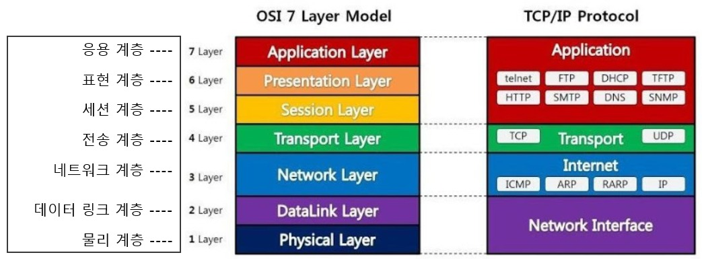

# OSI 7 Layer

네트워크에서 통신이 일어나는 과정을 7 단계로 나눈것
국제표준화기구(ISO)에서 네트워크 간의 호환을 위해 만듦

통신이 일어나는 과정을 단계별로 파악하고
통신 과정 중에 특정한 곳에 이상이 생길 경우

다른 단계의 장비 및 소프트웨어를 건드리지 않고 해결 할 수 있기 때문



1. Physical Layer

```
- 실제 장치를 연결하기 위한 전기적 기계적 기능적 사항과 연관된 계층
- 단지 데이터를 전달만 할뿐 데이터가 무엇인지, 에러가 있는지 등은 고려하지 않음
- 사용되는 단위는 bit

-> 케이블, 리피터, 허브를 통해 데이터를 전송
```

2. DataLink Layer

```
- 물리계층을 통해 송수신되는 정보의 오류와 흐름을 관리 => 안전한 정보의 전달
- 오류를 찾고 재전송
- Mac Adress를 사용하여 통신
- 전송되는 단위는 frame

-> 브릿지, 스위치 등을 통해 맥주소를 이용하여 물리계층에서 받은 정보를 전달

* Point-To-Point 간의 신뢰성있는 전송을 보장하기 위한 계층
주소값은 물리적으로 할당 받고, 이는 네트워크 카드가 만들어질 때부터 할당되어있음
주소 체계는 단일 구조

이더넷, HDLC, ADCCP, 패킷 스위칭 네트워크, LLC
```

3. Network Layer

```
- 데이터를 목적지까지 가장 안전하고 빠르게 전달하는 기능 (라우팅)
- 경로를 선택하고 주소를 정하고 경로에 따른 패킷을 전달
- 라우팅, 흐름제어, Segmaentation, 오류제어, Internetorking 등을 수행
- 데이터를 연결하는 다른 네트워크를 통해서 전달함으로써 인터넷이 가능하게 만드는 계층
- 논리적인 주소 구조(IP), 즉 네트워크 관리자가 직접 주소를 할당하는 구조를 가지며, 계층적
```

3.1 IP 계층

```
TCP/IP 상에서 IP 계층이란 네트워크의 주소(IP 주소)를 정의하고, IP 패킷의 전달 및 라우팅을 담당하는 계층

OSI 7계층모델의 관점에서 보면 IP 계층은 네트워크계층에 해당

- 즉, 패킷을 목적지까지 전달하는 역할 및 그에 수반되는 기타 역할을 함

* IP 계층의 주요 역할

- IP 계층에서는 그 하위계층인 데이터링크 계층의 하드웨어적인 특성에(ATM이든 Frame Relay이든 상관없이)관계없이 독립적인 역할을 수행

* IP 계층 상에 있는 주요 프로토콜

- 패킷의 전달을 책임지는 IP
- 패킷 전달 에러의 보고 및 진단을 위한 ICMP
- 복잡한 네트워크에서 인터네트워킹을 위한 경로를 찾게해주는 라우팅 프로토콜
```

4. Transport Layer
5. Session Layer
6. Presentation Layer
7. Application Layer
